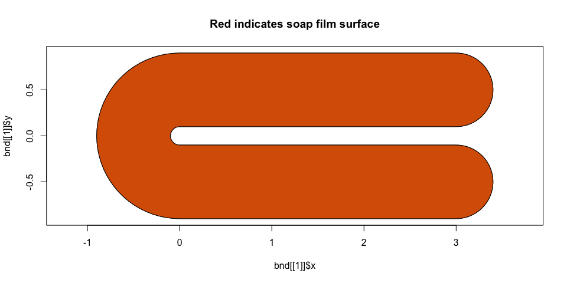

---
output:
  md_document:
    variant: gfm
    fig_width: 10
execute:
   eval: FALSE
---

```{r opts, echo = FALSE}
knitr::opts_chunk$set(
  fig.path = "man/figures"
)
```


# Check whether a soap film smoother boundary and knots make sense

Setting up a soap film smoother is often a hard and frustrating process. This function checks that the data that you feed to soap are "correct". Feed it our boundary and optionally knots and data and the function will show you what soap will model.

The function also plots the area that will be modelled by the soap film smoother in red.

To do all the spatial stuff, we require a couple of extra libraries: `rgeos` and `sp` (as well as `mgcv`).


## Ensuring the boundary is right

### Simple example with the "Ramsay horseshoe"

```{r ramsay, message=FALSE, warning=FALSE, eval=FALSE}
fsb <- list(fs.boundary())
soap_check(fsb)
```


### "inside-out" "Ramsay horseshoe

```{r ramsay-inverse, message=FALSE, warning=FALSE, eval=FALSE}
fsb_io <- fs.boundary()
fsb_io <- list(fsb_io,
               list(x=range(fsb_io$x)[c(1,1,2,2,1)],
                    y=range(fsb_io$y)[c(1,2,2,1,1)]))
soap_check(fsb_io)
```


### Knots

Sometimes knots are too close to the boundary, this end up with errors like:

```
Error in crunch.knots(ret$G, knots, x0, y0, dx, dy) :
  knot 10 is on or outside boundary
```

Generated by this code:

```{r bad-knots-setup,eval=FALSE}
## Simulate some fitting data, inside boundary...
set.seed(0)
n<-600
v <- runif(n)*5-1;w<-runif(n)*2-1
y <- fs.test(v,w,b=1)
names(fsb[[1]]) <- c("v","w")
ind <- inSide(fsb,x=v,y=w) ## remove outsiders
y <- y + rnorm(n)*.3 ## add noise
dat <- data.frame(y = y[ind],
                  v = v[ind],
                  w = w[ind])
# setup knots
knots <- expand.grid(v=seq(min(fsb[[1]]$v), max(fsb[[1]]$v), len=15),
                     w=seq(min(fsb[[1]]$w)+0.05, max(fsb[[1]]$w), len=10))
v <- knots$v
w <- knots$w
ind <- inSide(fsb,x=v,y=w) ## remove outsiders
knots <- knots[ind, ]
```
```{r bad-knots, eval=FALSE}
b <- gam(y~s(v,w,k=30,bs="so",xt=list(bnd=fsb)),knots=knots, data=dat)
```

One can go through, one-by-one and remove the offending knots as `crunch.knots` finds them, but that's a bit tedious. Enter `autocruncher`, which returns all of the offending knots at once:

```{r crunchy, eval=FALSE}
crunch_ind <- autocruncher(fsb, knots, k=30, xname="v", yname="w")
crunch_ind
```

We can see these knots are on the boundary are an issue (crosses):

```{r plot-crunch, eval=FALSE}
plot(fsb[[1]]$v, fsb[[1]]$w, type="l", asp=1, xlab="v", ylab="w")
points(knots)
points(knots[crunch_ind, ], pch=4)
```


We can now simply remove them and fit our model successfully (via `knots[-crunch_ind, ]`).

Note that you need to set the `k` argument to `autocruncher` to be the same as your planned value in `gam` and if you set the `nmax` parameter for the soap film you need to provide that to `autocruncher` too.

## Other tips

* The script assumes that your spatial variable names are `x` and `y`.
* Make sure that your locations are in Northings/Eastings. Using latitude and longitude will give strange results (as the soap film smoother is isotropic so treats 1 unit change in either dimension is equal, this isn't true for lat/long!).
* Sometimes you need to increase the tolerance (e.g `tol=1e-6`)
* Note that the boundary must be a `list` of `list`s or `data.frame`s. So if you have a polygon boundary with your boundary vertices in it, that must be wrapped in a `list`!


Written by David L Miller and released under the GPL (version 2).
